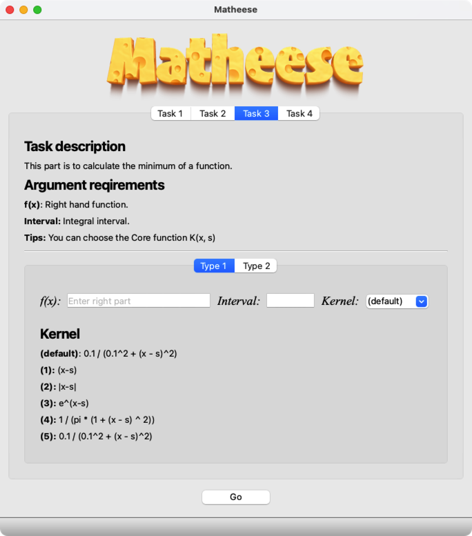

# Matheese
Matheese  is a tiny useful local application functioning in solving numerical problems.
And it is a course project which only implements several algorithm to solve some specific problems.
# GUI

